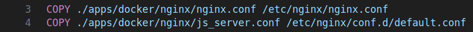
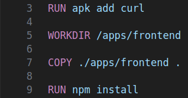
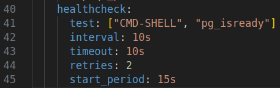
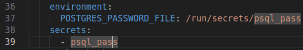
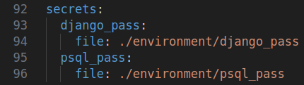
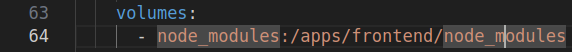
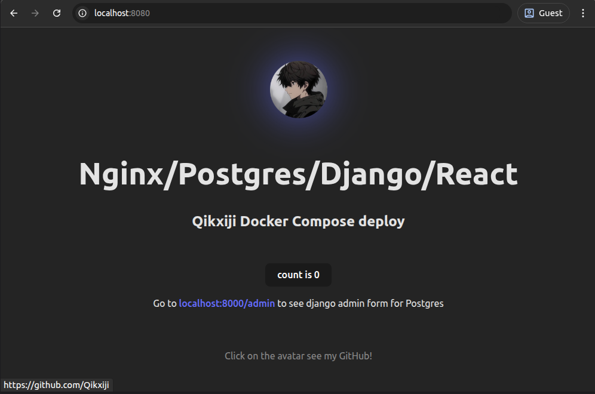
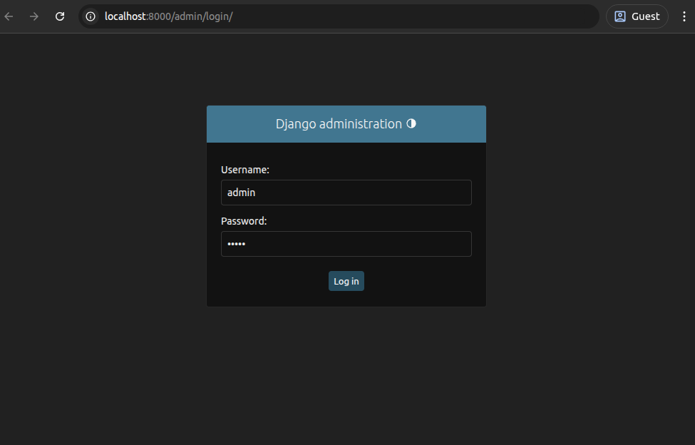

https://github.com/codingforinnovations/django-react-postgres

# Postgres/Nginx/Django/React Docker deploy

>Развёртывание шаблонного приложения на Django с помощью Docker Compose.

## Стек исходного приложения

- Nginx - веб/прокси-сервер. В проекте осуществляет отдачу статического контента и проксирование запросов пользователя к приложениям React и Django.
- React - библиотека JS для проектирования UI. В проекте React обрабатывает запросы пользователя к главной странице приложения. 
- Django - веб-фреймворк для разработки. В проекте используется для работы с БД через шаблонное окно администрирования.
- PostgreSQL - БД, подключение к которой осуществляется через окно администрирования Django.

## Структура проекта

```
$PROJECT_ROOT
│  
├── apps/backend/  # Директория Django приложения
│  
├── apps/docker/  # Директория с Dockerfiles для Django (образ python), React (образ node), Nginx(образ nginx)
│  
├── apps/frontend/  # Директория React приложения.
│
├── docker-compose.yaml # Файл конфигурации Docker Compose
│  
├── environment/  # Директория с переменными окружения и паролями (секретами) для Django и Postgres
```

- environment/ содержит файл `.env` с открытыми данными для авторизации Django, создания пользователя и БД в Postgres. Пароли для пользователя Django (DJANGO_SUPERUSER_PASSWORD) и Postgres (POSTGRES_PASSWORD) находятся в файлах django_pass и psql_pass и передаются в контейнеры не в виде переменных окружения, а в виде секретов. Эти данные пригодится при переходе в окно администрировавния. Их можно менять по своему усмотрению.
```bash
#открытые данные
POSTGRES_DB=root
POSTGRES_USER=root

DJANGO_SUPERUSER_USERNAME=admin
DJANGO_SUPERUSER_EMAIL=admin@admin.com

#данные для создания секретов 
POSTGRES_PASSWORD=root
DJANGO_SUPERUSER_PASSWORD=admin
``` 

## Пояснения к развёртыванию
Контейнеры Nginx, React и Django собираются из модифицированных образов, расположенных в apps/docker. Контейнер Postgres собирается из стандартного образа, подключаемого в файле Compose. Далее про модификации:
- В образы React и Django добавляется curl для реализации healthcheck (в образе Nginx установлен по умолчанию).


- В образ Django копируются файлы проекта, создается окружение, устанавдиваются зависимости, запускается скрипт инициализации приложения.


- В образ Nginx копируются файлы конфигурации для реализации проксирования.



- В образ React копируются файлы приложения, устанавливаются зависимости.



### Файл compose.yaml реализует развёртывание проекта из 4 сервисов. Средствами конфигурации Compose реализованы: 

- **Healthceck контейнеров:** реализованы `healthcheck` для всех контейнеров. Помогает гибко настроить последовательный запуск контейнеров, действия во время "падения" сервиса. Может быть использован для проверки состояния контейнеров в системе мониторинга.  



- **Последовательный запуск:** инструкция `depends_on` позволяет реализовать последовательный запуск сервисов. Django запустится только после запуска Postgres и прохождения им healthcheck. Nginx запускается для проксирования только после полного запуска Django и React приложений и прохождения ими healthcheck.


- **Пароли в секрете:** пароли, описанные выше передаются в контейнеры в виде `docker-secrets`. Файл с настоящими паролями добавляется в .dockerignore и .gitignore во избежание попадания в репозитории.

 

- **Тома Postgres и node_modules:** созданы именованные тома для хранения файлов БД и фиксации зависимостей React приложения.

 

- **Трансляция портов:** локальные ipv4 адреса контейнеров транслируются на следующий порты хоста: 8080 для Nginx, 5432 для Postgres, 8000 для Django и 3000 для React приложения.


## Требования для запуска
- Установить Docker, Compose обычно идет в комплекте.

## Запуск приложения

- Клонировать репозиторий 

```bash
git clone https://github.com/Qikxiji/DJANGO_PSQL_REACT_deploy.git .
```  

- Запустите сборку 
```bash
docker compose up --detach
```
По завершении сборки откройте [localhost:8080](http://localhost:8080) в браузере.


## Работа приложения
- Окно приложения React, возвращаемое прокси-сервером по адресу localhost:8080:



- Окно авторизации в Django приложение для администрирования Postgres



- Окно добавления сущностей в БД с помощью интерфейса Django


